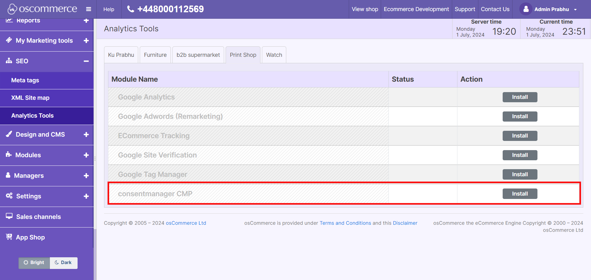
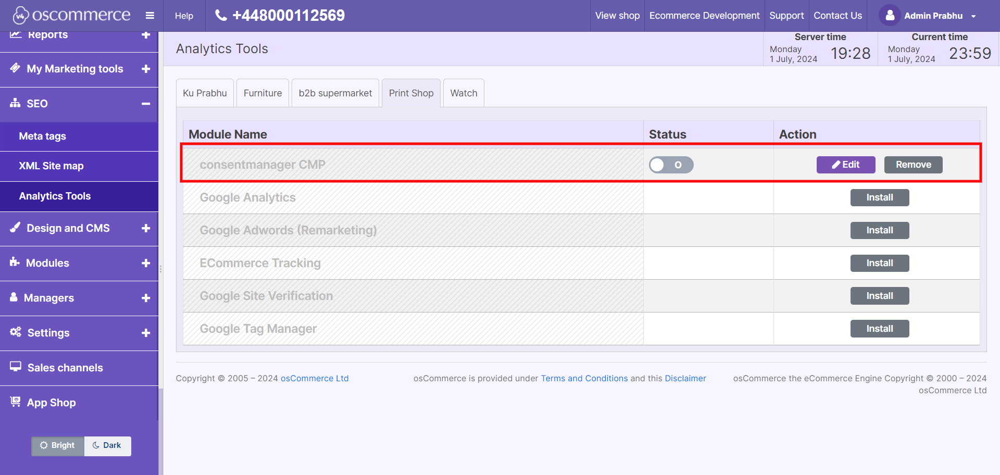
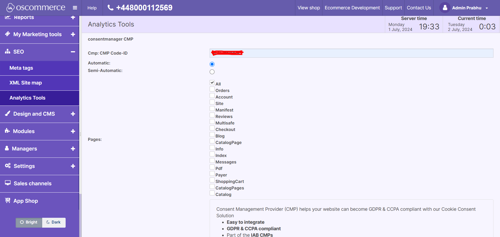

# ConsentManager.net

## Installation

1. Download the main repository package from (https://github.com/iubenda/cm-plugin-oscommerce4)
2. Unzip the package.
3. And upload the files of 'upload' folder to under path/to/project/ folder via FTP.
4. This package not overwriting any core files.

== Install ==

Here we need to edit a core file to include our module into Analytics modules list.
```lib\common\components\google\ModuleProvider.php```

Add this line of code  ```self::$modules[] = 'consentmanager';``` to the constructor as below:

```
public function __construct(GoogleSettingsRepository $gsRepository) {
	$this->gsRepository = $gsRepository;
	self::$modules[] = 'consentmanager';
}
```

1. Navigate to SEO => Analytics Tools
2. You can select any channel(if multi channel is installed) and click Install button to install the consentmanager to that channel.



## Upgradation

1. Download the main repository package from (https://github.com/iubenda/cm-plugin-oscommerce4)
2. Unzip the package.
3. And upload the files of 'upload' folder to under path/to/project/ folder via FTP.
4. This would overwrite/replace the old extension files.

## Configuration

1. Navigate to SEO => Analytics Tools
2. You can select any channel(if multi channel is installed) and click Edit button to configure the consentmanager to that channel. Only if already installed for that channel, then only Edit button displayed, otherwise you have to Install it for that specific channel before configuration.


3. And can enable/disable the extension using status switch field.
4. Enter CMP ID, you get this from consentmanager.net
5. Select the Mode: Automatic or Semi-Automatic



## Using

1. Go to shop frontend to view consentmanager.net in place. (The channel(s) you installed and configured the consentmanager)


## Changelog

= 1.0.0 =
* Initial release.
* Tested on 4.14.63493
* 01 Jul, 2024
